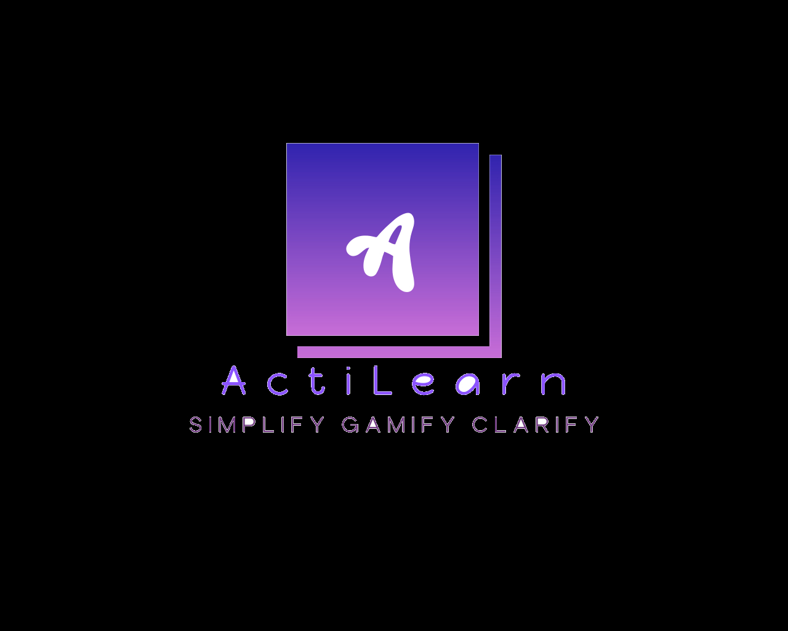

# ActiLearn 🧠
A simple interactive educational space and tool with friendly UI. 

## Introduction
ActiLearn is an interactive learning platform inspired by Unacademy, designed to *Simplify, Gamify, and Clarify* education. It features quizzes categorized by subject, a PDF summary converter tool, and informative pages to enhance user experience.

## Features
- Subject-based quizzes with score tracking  
- Dynamic animated backgrounds enhancing UI  
- PDF Summary Converter to extract and summarize PDFs  
- Dedicated pages for detailed project overview  
- Responsive and user-friendly interface

## Getting Started
### Prerequisites
- A modern web browser (Chrome, Firefox, Edge, Safari)  
- Optional: A local web server for best performance (e.g., VSCode Live Server)

### Installation
1. Clone the repo
2. Open the folder in your code editor or file explorer.  
3. Open index.html in your browser or serve the folder through a local server.

## Technologies Used

- HTML5  
- CSS3 (including animations)  
- JavaScript (ES6+)  
- PDF.js library (for PDF parsing)

## License
This project is licensed under the MIT License.

## Logo

### Short Note
Chosen Problem Statement -`FROM PASSIVE TO ACTIVE KNOWLEDGE`. Repo for Hack Battle'25 of -`Team Hack Sabbath`. This is a project made for Hack Battle 2025 organised by IEEE COMPUTER SOCIETY of VIT Vellore by Team Hack Sabbath.
